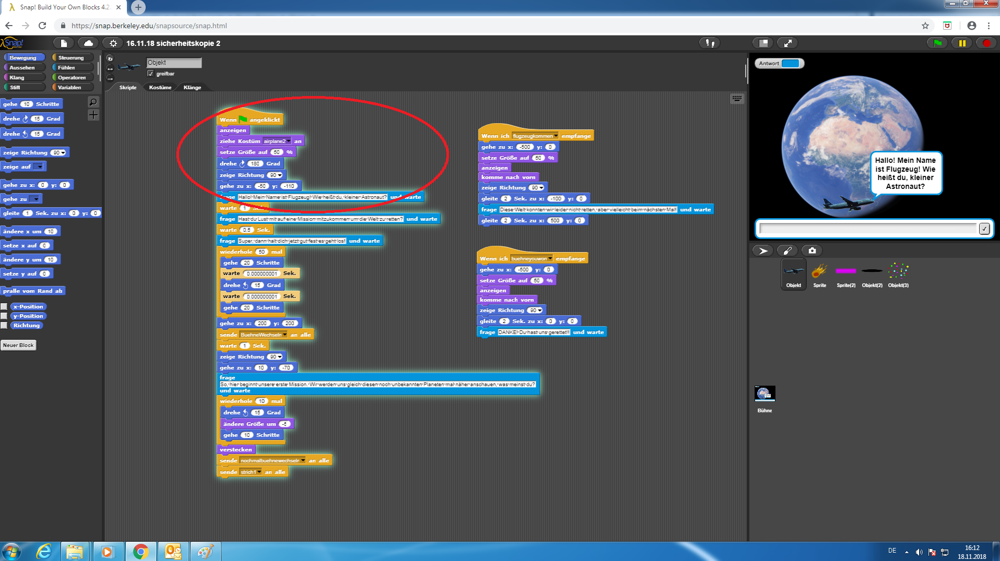
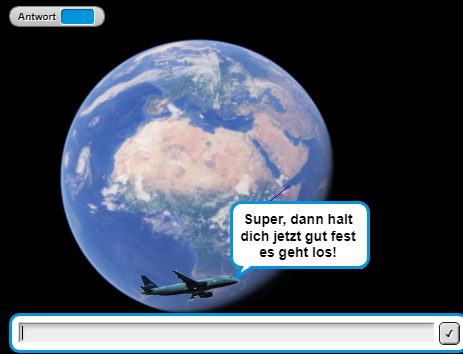
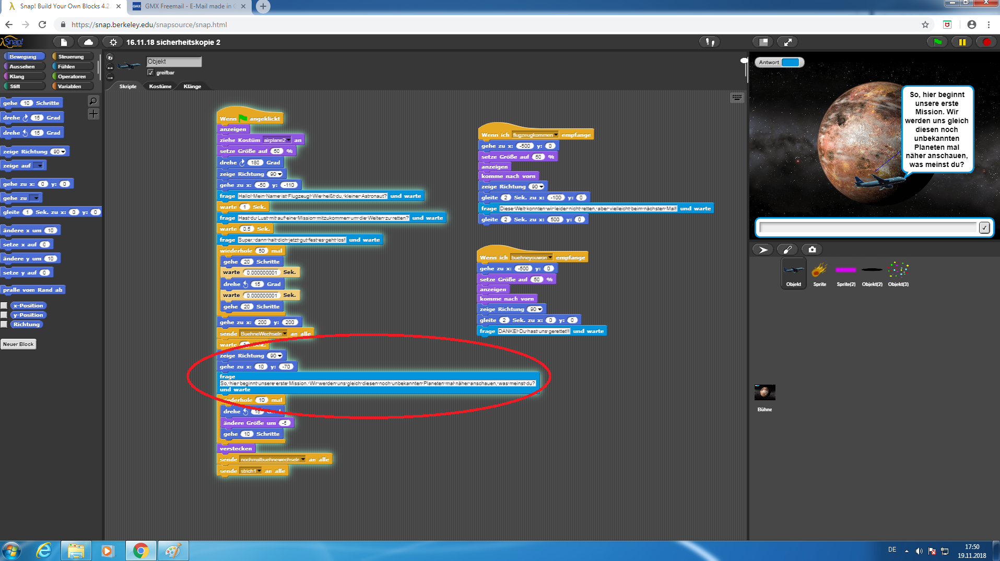
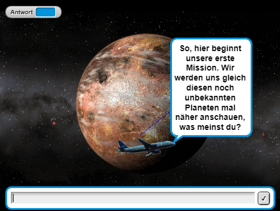
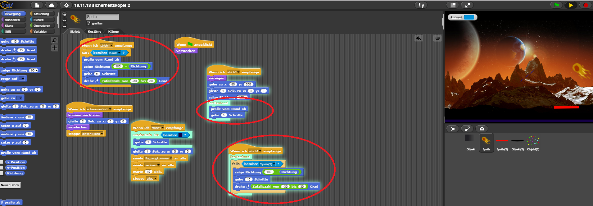
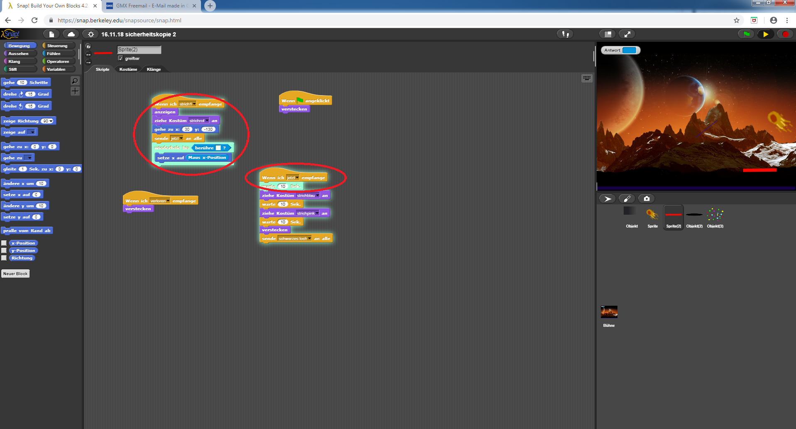

# BLOG

Ein Blog über unser programmiertes Spiel auf Snap! (The Beauty and Joy of Computing)

[1. Einleitung](#1)

##  Einleitung 
Willkommen auf unserem 2. Blog über unser Spiel. Hier erklären wir alles rund um unser Spiel, wie es funktioniert und auch wie wir mit Problemen umgegangen sind und sie gelöst haben. Dazu haben wir auch Bilder, um alles verständlicher zu machen und damit ihr auch ein Bild vor Augen habt.

Viel Spaß beim lesen!

Als kleine Einführung:
In unserem Spiel gibt es das Flugzeug, einen Meteor und einen Strich. Zu Anfang des Spiel interargiert man mit dem Flugzeug, welcher den Spieler also als Begleiter zur Seite steht. Es fragt den Spieler, ob er mit auf eine Mission möchte. Danach fliegt man mit ihm zu einem fremden Planeten. Hier beginnt dann das eigentliche Spiel. Das Ziel ist es, den Meteor mithilfe des Striches davon abzuhalten, den Boden zu berühren. Dies macht der Spieler indem er den Strich mit der Maus lenkt. Um das Spiel auch  etwas spannend zu machen, verkleinert sich der Strich nach einer gewissen Zeit. Folgenderweise gibt es also 2 Szenarios, wi e das Spiel ausgehen kann. Entweder ist das Spiel gewonnen wenn der Meteor den Boden nicht beruhrt hat bis die Zeit abgelaufen ist oder das Spiel ist verloren sobald der eben genannte Fall doch zutreffen sollte. Je anchdem ob man gewinnt oder verliert hat man als Spieler die Welt geretten oder auch nicht. Und darin liegt die Intention des Spiels, darin verschieden Welten zu retten.

Soviel zum Hintergrund des Spiel, jetzt erklären wir euch das Spiel!

Auf dem ersten Bild hier sind die Gesamten Befehle des Flugzeugs zu sehen. (Welche Befehle für die einzelnen Szenen zuständig sind, sind rot eingekreist.)

Der Befehl "Wenn *Fahne* angeklickt" bedeutet, dass wenn man das Symbol (oben rechts) anklickt, beginnt das Spiel uns somit alle Befehle. das bedeutet für den ersten Hintergrund (Erde), dass dieser jetzt auftauchen soll. Der Darauffolgende bedeutet, das das Kostüm "airplane1" angezogen wird. "Airplane1" steht für das Flugzeug und der Kasten "setzte Größe auf 50%" bedeutet, dass das Kostüm auf eine andere Größe gesetzte werden aknn und in unserem Fall war das Flugzeug zu groß. Daher haben wir es sozusagen kleiner auftauchen lassen. Das die genannten Befehle in einem lilanen Kasten sind heißt nichts anderes als das sie zu der Kategorie Aussehen gehören. (Es gitb ganz links auf der Projektseite eine Liste mit verschiedenen Kategorien: Bewegung, Aussehen, KLang, Stift, Steuerung, Fühlen, Operatoren und Variabeln. Zu diesen genannten Themen gibt es eine Reihe von Befehlen die man auswählen kann.) Als nächsten Befehl hat das Flugzeug 3 blaue Befehle. Diese gehören zur Bewegung. Diese geben die Ausrichtung und Koordinaten an. Der letzte Befehl der Szene ist hier in hellbalu zu sehen. In den Kasten kann man eine Frage reinschreiben und wir haben uns für "Hallo! Mein name ist Flugzeug! Wie heißt du kleiner Astronaut?" entschieden. Durch das aktivieren von "Antwort" im Zusammenhang mit dem Fragebefehl, kann der Spieler nun antworten.

Nachdem der Spieler geantwortet hat, fragt das Flugzeug "Hast du Lust mit auf eine Mission mitzukommen um die Welten zu retten?" und auch darauf kann der Spieler antworten. Danach folgt von dem Kostüm die Nachricht, dass es jetzt los geht.

Durch den folgenden Befehl aus dem Themenbereich Steuerung "Wiederhole 50 Mal" werden die in dem Befehl enthaltenen Befehle in diesem Fall 50 Mal wiederholt. Die in dem eben gennaten Befehl enthaltenen Befehle bedeuten, dass das Flugzeug erst ein paar Schritte geht, sich dann um ein paar Grad (15°) dreht und dann erneut ein paar Schritte geht. Zusammengesetzt und in Ausführung sieht es dann schließlich so aus, dass das Flugzeug um den Planenten fliegt und dies 2 Mal. Zum Schluss sagt der Befehl "gehe zu X=200 Y=200", dass das Kostüm aus dem Bild fliegt.

Der nächste Befehl "sende *Bühnenwechsel* an alle" bedeutet, dass einen Nachricht an alle anderen Kostüme sowie Hintergründe gesendet wird. Dadurch können die verschiedenen Sprites kommunizieren. Diese Nachricht wird in unserem Fall an den Hintergrund gesendet. Mit dem Befehl "Wenn ich ... empfange" führt er die ihmgehörigen Befehle erst dann aus, sobald er die Nachricht bekommt. Danach soll das Flugzeug eine Sekunde warten und schließlich in "Richtung 90" zeigen und zu den Koordinaten X:10 Y:-70 gehen. Das letzte was das Flugzeug in dieser Szene zu dem Spieler sagt ist "So, hier beginnt unsere erste Mission. Wir werden uns gleich diesen noch unbekannten Planeten mal näher anschauen, was meinst du?". Nachdem man geantwortet hat kommt erneut der Befehl "Wiederhole (10 Mal)". Dieser Befehl beinhaltet diesmal die Drehung um 15°, die Änderung der Größe um -5 und das Gehen von 10 Schritten. zusammengesetzt sieht das im Spiel so als, als würde das Flugzeug auf den Planeten zufliegen und dann verschwinden.

Nachdem das Flugzeug dann auf den Planent zufliegt und dort verschwindet, findet sich der Spieler auf dem fremden Planeten wieder. Als nächstes beginnt dann schon das "richtige" Spiel. Dieses Szenario besteht aus dem ersten Strich (rot) und dem Meteor "Metheory". ZUnächst bewegt sich der Meteor auf die Mitte der Bildschirms zu und fängt dann an sich zufällig durch den Raum zu bewegen.

Auf den Bildern sieht man zum einen die aktiven Befehle für den Meteor und zum Anderen die für den/die Strich/e.

