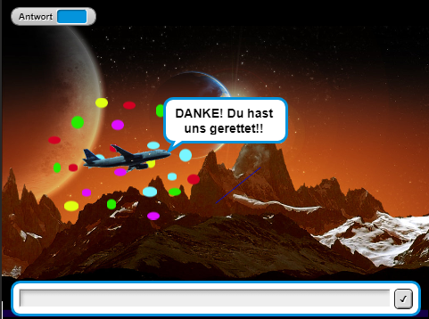
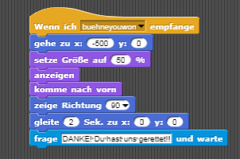
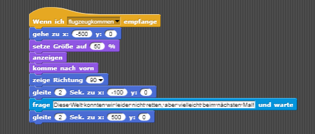
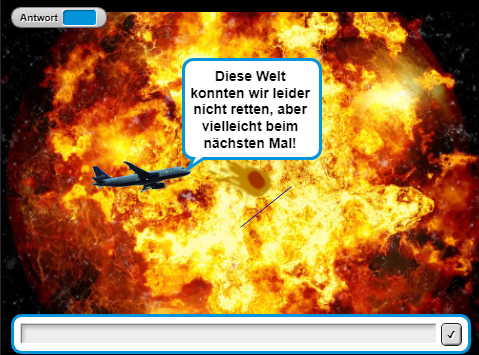

# Blog über das Spiel "Planet vs. Komet"

Ein Blog über unser programmiertes Spiel auf Snap! (The Beauty and Joy of Computing)

[1. Einleitung und Idee](#1)

[2. Die Geschichte des Spiels](#2)

[3. Das Spiel](#3)

[4. Gewonnen](#4)

[5. Verloren](#5)

##  Einleitung und Idee
Willkommen auf unserem 2. Blog über unser Spiel "Planet vs. Komet". Hier erklären wir alles rund um unser Spiel, wie es funktioniert und auch wie wir mit Problemen umgegangen sind und sie gelöst haben. Dazu haben wir auch Bilder, um alles verständlicher zu machen und damit ihr auch ein Bild vor Augen habt.

Viel Spaß beim lesen!

Als kleine Einführung:
Anfangs hatten wir noch keine wirkliche Vorstellung davon, was uns in dem Fach "Informatik" erwartet, wie die verschiedenen Programme funktionieren und was wir leztendlich erschaffen wollen. 
Nach einigen Stunden des Ausprobierens und Programmierens, sowie dem Testen von verschiedenen uns zur Verfügung stehenden Programmen haben wir uns für "The Beauty And Joy Of Computing", kurz Snap! entschieden. Snap schien uns vergleichweise einfach, da die Befehle bereits als "Puzzleteile" zur Verfügung stehen und sich so zusammen setzen lassen, dass sie den gewünschten Effekt erzielen und nicht wie bei anderen Programmen selbst getippt werden müssen. 
Uns war von Anfang an ziemlich klar, dass wir etwas interaktives gestalten wollen, an dem beispielsweise auch unsere Geschwister Spaß haben würden. Wir sind von Themen ausgegangen, die auch Kinder, beziehungsweise Teenis interessieren und haben uns schließlich für den Weltraum und einen fremden Planten entschieden, da dieses Thema sehr faszinierend ist und sich eindrucksvoll gestalten lässt. 
Im Folgenden haben wir beide unsere jüngeren Geschwister (insgesamt 4 Brüder und eine Schwester, also viele Meinungen) befragt, welche Art von Spielen sie gerne spielen um ihre Zeit zu vertreiben und was ihnen an diesen Spielen besonders wichtig ist beziehungsweise ihnen sozusagen das "gewisse Extra" verleiht. 
Allgemein fiel dabei auf, das Spiele besonders gerne gespielt werden, hinter denen auch eine Story steht, in welche man als Akteuer direkt mit eingebunden wird und über den Ausgang entscheidet. Mit diesem Hintergrund bietet das Spiel nämlich einen gewissen Mehrwert und eine größere Spannung. 
Aufgrund besagter Feststellung kam uns dann die Idee, das sich der Spieler auf die Reise zu einem unbekannten Planten begibt und diesen dann vor einer Bedrohung retten muss. Diese Idee haben wir während des Schaffungsprozesses noch weiter ausgearbeitet und schlussendlich hat sich dann herauskristallisiert, dass das Spiel daraus bestehen wird, dass der Spieler einen Meteoriteneinschlag auf den Planeten verhindern und ihn so vor dem Untergang retten kann.
In unserem Spiel gibt es das Flugzeug, einen Meteor und einen Strich beziehungsweise eine Plattform. Zu Anfang des Spiel interargiert man mit dem Flugzeug, welcher dem Spieler also als Begleiter zur Seite steht. Es fragt den Spieler, ob er mit auf eine Mission kommen möchte. Danach fliegt man mit ihm zu einem fremden Planeten. Hier beginnt dann das eigentliche Spiel. Das Ziel ist es, den Meteor mithilfe des Striches davon abzuhalten, den Boden zu berühren. Dies macht der Spieler indem er den Strich mit der Maus lenkt. Um das Spiel noch spannender zu gestalten, verkleinert sich der Strich nach einer gewissen Zeit. Folgenderweise gibt es also 2 Szenarien, wie das Spiel ausgehen kann. Entweder ist das Spiel gewonnen, wenn der Meteor den Boden nicht berührt hat bis die Zeit abgelaufen ist oder das Spiel ist verloren sobald der eben genannte Fall doch zutreffen sollte. Je nachdem ob man gewinnt oder verliert hat man als Spieler die Welt geretten oder auch nicht. Daraus besteht auch die Intention des Spiels. Schaffst du es, die Welt zu retten?

Den Namen des Spiels "Planet vs. Komet" haben wir so gewählt, dass er Spannung verspricht, stimmig klingt und gleichzeit in drei Worten den Sinn und Inhalt des Spiels relativ treffend widergibt.

Soviel zum Hintergrund des Spiel, jetzt erklären wir euch das Spiel!

##  Die Geschichte des Spiels
Auf dem ersten Bild hier sind die gesammten Befehle des Flugzeugs zu sehen ( Die zuständigen Befehle für die einzelnen Szenen sind rot eingekreist).

Der Befehl "Wenn *Fahne* angeklickt" bedeutet, dass wenn man das Symbol (oben rechts) anklickt, beginnt das Spiel und somit alle Befehle, die ebenfalls die Fahne als Startsymbol haben. Das bedeutet für den ersten Hintergrund (Erde), dass dieser jetzt auftauchen soll. Der Darauffolgende bedeutet, das das Kostüm "airplane1" angezogen wird. "Airplane1" steht für das Flugzeug und der Kasten "setzte Größe auf 50%" bedeutet, dass das Kostüm auf eine andere Größe gesetzt wird, denn in unserem Fall war das Flugzeug zu groß. Daher haben wir es kleiner auftauchen lassen, ohne dass die Konturen verschwimmen (wie es bei einer Bearbeitung mit Verkleinerung des Kostüms der Fall gewesen wäre). Der Grund dafür, dass die genannten Befehle in einem lilanen Kasten sind ist, dass sie zu der Kategorie Aussehen gehören. (Es gibt ganz links auf der Projektseite eine Liste mit verschiedenen Kategorien: Bewegung, Aussehen, KLang, Stift, Steuerung, Fühlen, Operatoren und Variabeln. Zu diesen genannten Themen gibt es eine Reihe von Befehlen die man auswählen kann.) Als nächste Befehle für das Flugzeug folgen 3 blaue. Diese gehören zur Bewegung und geben die Ausrichtung und Koordinaten an. Der letzte Befehl der Szene ist hier in hellblau zu sehen. In den Kasten kann man eine Frage reinschreiben und wir haben uns für "Hallo! Mein Name ist Flugzeug! Wie heißt du kleiner Astronaut?" entschieden. Durch das aktivieren von "Antwort" im Zusammenhang mit dem Fragebefehl kann der Spieler nun antworten bzw. das Programm wartet auf eine Antwort die mit der "Enter" Taste bestätigt wird, bevor die folgenden Befehle ausgeführt werden.

Nachdem der Spieler geantwortet hat, fragt das Flugzeug "Hast du Lust mit auf eine Mission mitzukommen um die Welten zu retten?" und auch darauf kann der Spieler antworten. Ist Letzteres geschehen, teilt das Flugzeug dem Spieler mit, dass es jetzt los geht auf die Reise.

Durch den folgenden Befehl aus dem Themenbereich Steuerung ("Wiederhole 50 Mal") werden die dort drin eingefügten Befehle in diesem Fall 50 Mal wiederholt. Die in dem eben genannten Befehl enthaltenen Befehle bedeuten, dass das Flugzeug erst ein paar Schritte geht, sich dann um ein paar Grad (15°) dreht und dann erneut ein paar Schritte geht. Zusammengesetzt und in Ausführung sieht es dann schließlich so aus, dass das Flugzeug um den Planenten fliegt und dies 2 Mal. Darauf folgt der Befehl "gehe zu X=200 Y=200", welcher dafür sorgt, dass das Kostüm aus dem Bild fliegt.

Der nächste Befehl "sende *Bühnenwechsel* an alle" bedeutet, dass einen Nachricht an alle anderen Kostüme sowie Hintergründe gesendet wird. Dadurch können die verschiedenen Sprites kommunizieren. Diese Nachricht wird in unserem Fall an den Hintergrund gesendet. Mit dem Befehl "Wenn ich ... empfange" werden die folgenden Befehle erst dann ausgeführt, sobald die Nachricht ... empfangen wird. Danach soll das Flugzeug eine Sekunde warten und schließlich in "Richtung 90" zeigen und zu den Koordinaten X:10 Y:-70 gehen. Das letzte was das Flugzeug in dieser Szene zu dem Spieler sagt ist "So, hier beginnt unsere erste Mission. Wir werden uns gleich diesen noch unbekannten Planeten mal näher anschauen, was meinst du?". Nachdem geantwortet wurde, kommt erneut der Befehl "Wiederhole (10 Mal)". Dieser Befehl beinhaltet diesmal die Drehung um 15°, die Änderung der Größe um -5 und das Gehen von 10 Schritten. Zusammengesetzt sieht das im Spiel so aus, als würde das Flugzeug auf den Planeten zufliegen und dann verschwinden.

##  Das Spiel
Nachdem das Flugzeug dann auf den Planent zufliegt und dort verschwindet, findet sich der Spieler auf dem fremden Planeten wieder. Als nächstes beginnt dann schon das "richtige" Spiel. Dieses Szenario besteht aus dem ersten Strich (rot) und dem Meteor "Metheory". Zunächst bewegt sich der Meteor auf die Mitte des Bildschirms zu und fängt dann an, sich zufällig durch den Raum zu bewegen.

Auf den oberen Bild sind die aktiven Befehle, also die die in diesem Moment aktiv sind, wieder markiert. Diese beziehen sich hier auf den Meteor. Das untere Bild zeigt die Befehle die auf den ersten Strich zutreffen. 

Wie schon oben geschrieben, besteht nun der Sinn des Spiels darin, den Meteor davon abzuhalten auf den Boden zu kommen. Um dies zu bewerkstelligen habe wir die Befehle links oben auf dem Bild benutzt. Diese setzten sich aus dem Befehl "wenn ich *strich1* empfange", "anzeigen", "ziehe Kostüm *strich1* an", "gehe zu X=30 Y=-130", "sende *jetzt* an alle", "wiederhole bis *berühre?*" und "setzte X auf *Maus X Position*" zusammen. Das "Anzeigen" ist dort unerlässlich, da wir mit dem Befehl "Wenn *Fahne* angeklickt" die Sprite erstmal versteckt haben. Dies haben wir gemacht, damit der Strich erst auftaucht, wenn die Sprite die Nachricht bekommt. Nachdem sie dann sichtbar ist, soll sie zu den oben genannten Koordinaten gehen und eine Nachricht an alle Objekte schicken. Den Befehl sendet sie aber im Prinzip an sich selber, was man auf dem Befehlblock rechts auf dem Bild sehen kann. Auf die Nachricht folgend hat sie dann den Befehl, etwas bestimmtes auszuführen und was in diesem Fall bedeutet, dass sie der X Koordinate der Maus zu folgt. Mit den Koordinaten und dem Folgen der Maus, bewegt sich der Strich also auf einer Linie (X). Somit kann der Meteor also davon abgehalten werden den Boden zu berühreren, da er an dem Strick abprallt.
Nach nun 10 Sekunden wechselt der Strich sein Kostüm zu einem kleineren, blauen Strich. Dies ist dann die nächste Schwierigkeitsstufe, da das Aufhalten des Meteors nun schwieriger wird, da nur noch eine kleinere Fläche zur Verfügung steht. Nach weiteren 10 Sekunden wechselt das Kostüm erneut und ein noch kleinerer pinker Strich taucht nun auf. 
Durch folgende Befehle haben wir den Kostümwechsel programmiert:

Die letzten Befehle "verstecken" und "sende *schwarzes Loch* an alle" bedeuten, dass der Strich nach den insgesamt 30 Sekunden verschwinden soll. Der letzte Strich sendet also eine Nachricht an ein anderes Kostüm, das "Schwarzes Loch". Dieses taucht demzufolge nur dann auf, wenn das Spiel gewonnen ist. Es taucht wie auch die vorherigen Kostüme nach dem Befehl "wenn ich ... empfange" auf. Seine Aufgabe soll es sein, den Meteor aufzusaugen. Damit ist die Gefahr für den Planenten vernichtet.

##  Gewonnen

Das Verschwinden des Meteors wird durch die Befehle des Schwarzen Loches visualisiert, die daraus bestehen, dass das Loch zu den Koordinaten X=0 und Y=0 geht und dann dort für ein paar Sekunen bleibt. Nach der Wartezeit soll sich auch diese Sprite verstecken. Danach ist der letzte Befehl dieser Sprite, dass sie "sende *buehneyouwon* an alle" absendet. Die Nachricht empfängt daraufhin das Flugzeug.
Da das Spiel in diesem Fall gewonnen wurde, kommt in der nächsten Szene wieder das Flugzeug angeflogen, gefolgt von buntem Konfetti. Dem Spieler wird dazu gratuliert, dass er diese Welt gerettet hat. Durch die untenstehenden Befehl wird bewirkt, dass das Flugzeug von den Koordinaten X=-500 Y=0 zu X=0 Y=0 "gleitet". Umgesetzt sieht das so aus als würde es von außerhalb in die Mitte des Bilds fliegen. Dabei haben wir erneut eine gewisse Ausrichtung angegeben und die Größe festgelegt. Zum Schluss sagt es "DANKE! Du hast uns gerettet!!"

          

##  Verloren

Kommen wir nun zum zweiten möglichen Fall, nämlich dass Spiel zu verlieren. Verloren hat man, wie schon erwähnt, wenn man den Meteor nicht davon abhält, den Boden zu berühren. Denn wenn er das tut, dann zerstört der dadurch die Welt. Wenn dies eintritt sind folgende Befehle dafür zuständig:

            

Die Befehle für den Meteor bestehen daraus, dass er erstmal zu den Koordinaten X=0 und Y=0 wandern soll. Danach sendet er die Nachricht "sende *flugzeugkommen* an alle" ab und wartet 10 Sekunden. Die Zeit ist nötig, damit die damit verbundenen Befehle noch Zeit haben sich auszuführen, bevor der letzte Befehl "stoppe *alles*" eintritt, denn damit wird das Spiel beendet und es passiert nichts mehr. In diesem Fall muss man das Spiel noch einmal von vorne anfangen.
Die Nachricht die vorhin abgesendet wurde empfängt wieder das Flugzeug. Seine ersten Befehle sind genau die gleichen wie bei dem oben beschrieben Fall des gewinnens. Die Szene endet damit, dass das Flugzeug zu den Koordinaten X=500 Y=0 "gleitet" und davor sagt: "Diese Welt konnten wir nicht retten, aber vielleicht beim nächsten Mal!"

Schlussendlich lässt sich sagen, dass das Spiel genau das erreicht hat, was anfänglich unsere Intention war: Unsere Geschwister finden es richtig klasse und sind begeisterte Raumfahrer und Weltretter geworden ;)
Kannst auch du die unerforschte Welt vor dem Untergang retten? Finde es heraus und rette den Planeten vor dem Kometen!  
